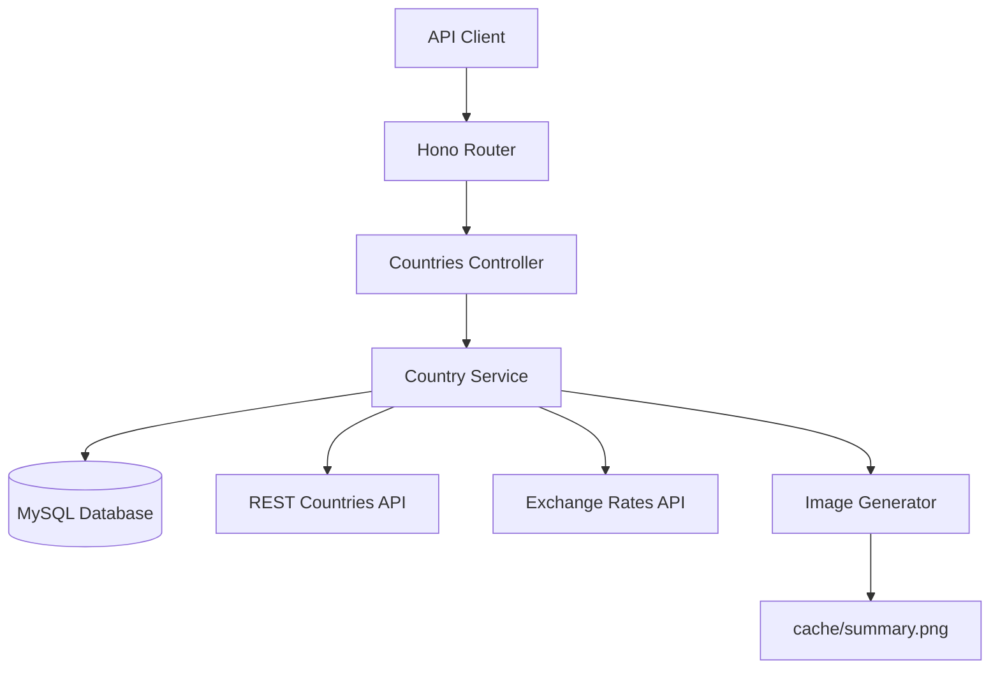

# Design Document

## Overview

The Country Currency & Exchange API is built using Node.js with the Hono framework, following a layered architecture pattern. The system integrates with external REST APIs to fetch country and exchange rate data, processes and enriches this information, and provides a comprehensive RESTful interface with MySQL persistence and image generation capabilities.

## Architecture

### System Architecture



### Layered Architecture

1. **Presentation Layer**: Hono routes and controllers handling HTTP requests/responses
2. **Business Logic Layer**: Services containing core business logic and data processing
3. **Data Access Layer**: Database service and external API integrations
4. **Persistence Layer**: MySQL database and file system for image storage

## Components and Interfaces

### 1. Database Schema

```sql
CREATE TABLE countries (
    id INT AUTO_INCREMENT PRIMARY KEY,
    name VARCHAR(255) NOT NULL UNIQUE,
    capital VARCHAR(255),
    region VARCHAR(255),
    population BIGINT NOT NULL,
    currency_code VARCHAR(10),
    exchange_rate DECIMAL(15,6),
    estimated_gdp DECIMAL(20,2),
    flag_url TEXT,
    last_refreshed_at TIMESTAMP DEFAULT CURRENT_TIMESTAMP ON UPDATE CURRENT_TIMESTAMP,
    created_at TIMESTAMP DEFAULT CURRENT_TIMESTAMP,
    INDEX idx_region (region),
    INDEX idx_currency (currency_code),
    INDEX idx_gdp (estimated_gdp)
);

CREATE TABLE system_status (
    id INT PRIMARY KEY DEFAULT 1,
    last_refreshed_at TIMESTAMP,
    total_countries INT DEFAULT 0,
    CHECK (id = 1)
);
```

### 2. TypeScript Interfaces

```typescript
interface Country {
    id?: number;
    name: string;
    capital?: string;
    region?: string;
    population: number;
    currency_code?: string;
    exchange_rate?: number;
    estimated_gdp?: number;
    flag_url?: string;
    last_refreshed_at?: Date;
}

interface ExternalCountry {
    name: string;
    capital?: string;
    region?: string;
    population: number;
    flag?: string;
    currencies?: Array<{
        code: string;
        name: string;
        symbol: string;
    }>;
}

interface ExchangeRates {
    base: string;
    rates: Record<string, number>;
}

interface CountryFilters {
    region?: string;
    currency?: string;
    sort?: 'gdp_desc' | 'name_asc';
}

interface SystemStatus {
    total_countries: number;
    last_refreshed_at: string;
}
```

### 3. Service Layer Design

#### CountryService
- `refreshCountries()`: Orchestrates the complete refresh process
- `getAllCountries(filters: CountryFilters)`: Retrieves countries with filtering/sorting
- `getCountryByName(name: string)`: Fetches single country
- `deleteCountryByName(name: string)`: Removes country record
- `getSystemStatus()`: Returns system statistics

#### ExternalAPIService
- `fetchCountriesData()`: Calls REST Countries API
- `fetchExchangeRates()`: Calls Exchange Rates API
- `handleAPITimeout()`: Manages API timeout scenarios

#### DatabaseService
- `upsertCountry(country: Country)`: Insert or update country
- `findCountries(filters: CountryFilters)`: Query with filters
- `findCountryByName(name: string)`: Single country lookup
- `deleteCountry(name: string)`: Remove country
- `updateSystemStatus()`: Update global status

#### ImageGenerationService
- `generateSummaryImage(data: SummaryData)`: Creates PNG image
- `saveSummaryImage(buffer: Buffer)`: Saves to file system
- `serveSummaryImage()`: Returns image file

### 4. Controller Layer

#### CountriesController
```typescript
class CountriesController {
    async refreshCountries(c: Context): Promise<Response>
    async getCountries(c: Context): Promise<Response>
    async getCountryByName(c: Context): Promise<Response>
    async deleteCountryByName(c: Context): Promise<Response>
    async getSystemStatus(c: Context): Promise<Response>
    async getSummaryImage(c: Context): Promise<Response>
}
```

### 5. Route Configuration

```typescript
// Routes mapping
POST   /countries/refresh     -> refreshCountries()
GET    /countries             -> getCountries()
GET    /countries/:name       -> getCountryByName()
DELETE /countries/:name       -> deleteCountryByName()
GET    /status                -> getSystemStatus()
GET    /countries/image       -> getSummaryImage()
```

## Data Models

### Country Processing Flow

1. **External Data Ingestion**
   - Fetch from REST Countries API with specific fields
   - Extract first currency code from currencies array
   - Handle missing or empty currency data

2. **Exchange Rate Integration**
   - Fetch USD-based rates from Exchange Rates API
   - Match country currencies with exchange rates
   - Handle missing currency codes gracefully

3. **GDP Calculation**
   - Generate random multiplier (1000-2000) per country per refresh
   - Formula: `estimated_gdp = population × random_multiplier ÷ exchange_rate`
   - Set to 0 or null for missing exchange rate data

4. **Database Persistence**
   - Case-insensitive name matching for updates
   - Upsert operation (update existing, insert new)
   - Maintain referential integrity

### Filtering and Sorting Logic

```typescript
// Query building logic
const buildCountryQuery = (filters: CountryFilters) => {
    let query = 'SELECT * FROM countries WHERE 1=1';
    const params: any[] = [];
    
    if (filters.region) {
        query += ' AND region = ?';
        params.push(filters.region);
    }
    
    if (filters.currency) {
        query += ' AND currency_code = ?';
        params.push(filters.currency);
    }
    
    if (filters.sort === 'gdp_desc') {
        query += ' ORDER BY estimated_gdp DESC';
    }
    
    return { query, params };
};
```

## Error Handling

### Error Response Strategy

1. **Consistent Error Format**
```typescript
interface ErrorResponse {
    error: string;
    details?: string | Record<string, string>;
}
```

2. **HTTP Status Code Mapping**
   - 200: Successful operations
   - 400: Validation failures
   - 404: Resource not found
   - 500: Internal server errors
   - 503: External service unavailable

3. **External API Error Handling**
```typescript
const handleExternalAPIError = (apiName: string, error: Error) => {
    return {
        status: 503,
        body: {
            error: "External data source unavailable",
            details: `Could not fetch data from ${apiName}`
        }
    };
};
```

### Validation Strategy

```typescript
const validateCountryData = (country: Partial<Country>) => {
    const errors: Record<string, string> = {};
    
    if (!country.name) errors.name = 'is required';
    if (!country.population) errors.population = 'is required';
    if (country.currency_code === undefined) errors.currency_code = 'is required';
    
    if (Object.keys(errors).length > 0) {
        throw new ValidationError('Validation failed', errors);
    }
};
```

## Testing Strategy

### Unit Testing
- Service layer methods with mocked dependencies
- Data transformation and calculation logic
- Validation functions
- Error handling scenarios

### Integration Testing
- Database operations with test database
- External API integration with mock servers
- End-to-end request/response cycles

### Test Data Management
- Seed data for consistent testing
- Mock external API responses
- Test database cleanup between tests

### Performance Testing
- Load testing for concurrent requests
- Database query performance
- External API timeout handling
- Memory usage during large data processing

## Configuration Management

### Environment Variables
```typescript
interface Config {
    PORT: number;
    MYSQLHOST: string;
    MYSQLPORT: number;
    MYSQLDATABASE: string;
    MYSQLUSER: string;
    MYSQLPASSWORD: string;
    COUNTRIES_API_URL: string;
    EXCHANGE_API_URL: string;
    CACHE_DIR: string;
    API_TIMEOUT: number;
}
```

### Database Connection
- Connection pooling for performance
- Automatic reconnection handling
- Transaction management for data consistency

### External API Configuration
- Configurable timeout values
- Retry logic for transient failures
- Rate limiting considerations

## Security Considerations

### Input Validation
- SQL injection prevention through parameterized queries
- Input sanitization for country names
- File path validation for image serving

### Error Information Disclosure
- Generic error messages for external failures
- No sensitive information in error responses
- Proper logging without exposing credentials

### Database Security
- Encrypted connections
- Principle of least privilege for database user
- Regular security updates

## Performance Optimizations

### Database Indexing
- Indexes on frequently queried fields (region, currency_code, estimated_gdp)
- Composite indexes for common filter combinations

### Caching Strategy
- Database-level caching for country data
- File system caching for generated images
- HTTP response caching headers

### Batch Processing
- Bulk insert/update operations during refresh
- Efficient data transformation pipelines
- Memory-conscious processing for large datasets